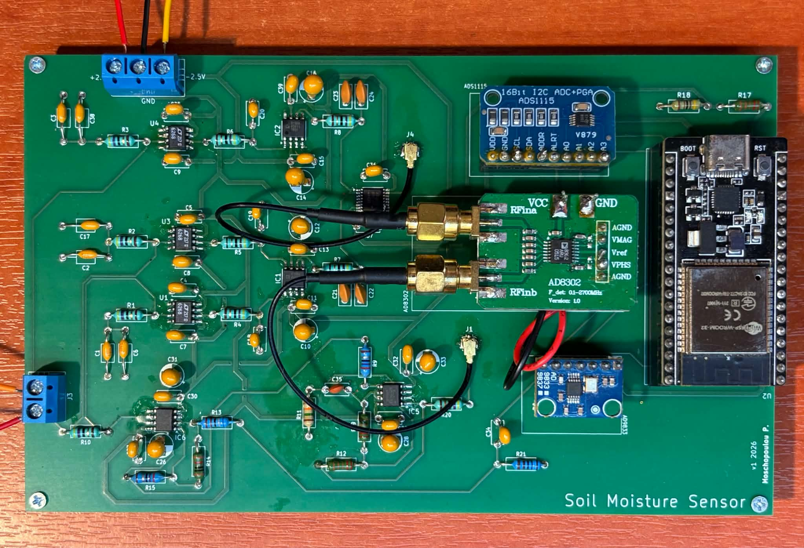

# Soil Moisture Sensor Thesis

This repository contains the omplete soil-moisture measurement project:

- ESP32 firmware for impedance measurement, Wi-Fi provisioning, and Arduino Cloud publishing.
- KiCad schematic and PCB sources for the measurement hardware.
- R scripts used to analyze the soil samples examined in impedance spectroscopy 
- The editable LaTeX thesis and its figures.



## Repository layout

```text
.
|-- firmware/                           ESP32 PlatformIO project
|   |-- include/                        Cloud definitions and local secrets
|   |-- src/                            Application code
|   `-- platformio.ini                  Board, framework, and library settings        
|-- analysis/impedance_spectroscopy/    R analysis scripts and usage notes
|-- PCB/kicad/soil-board/               KiCad schematic, PCB, and project files
|-- thesis/                             LaTeX sources, bibliography, and figures
```


## Firmware overview

The firmware targets an ESP32 NodeMCU-32S. It drives the measurement circuit,
calculates resistance (`RP`) and capacitance (`CP`), and publishes the results
to Arduino Cloud.

WiFiManager handles Wi-Fi setup without needing hard-coded network credentials. Known
networks are stored in the ESP32's non-volatile memory. At startup, the device
tries to connect to saved networks and opens a setup portal when none can
be reached.

### Analog parts

1. LTC6268
2. AD8130
3. AD8066
4. ADG733

### Modules

1. AD9833 waveform generator
2. ADS1115 ADC
3. AD8302 gain-phase detector

## Firmware development environment

Install:

1. [Visual Studio Code](https://code.visualstudio.com/)
2. The PlatformIO IDE extension for VS Code
3. The CP210x USB-to-UART driver if the ESP32 does not appear as a Windows COM port

Open the `firmware/` folder in VS Code. PlatformIO reads the exact toolchain and
library versions pinned in `firmware/platformio.ini`.

## Configure private secrets

Copy `firmware/include/arduino_secrets.h`, then add the matching Arduino Cloud
device key. Don't commit this file or share its contents.

```cpp
#pragma once

#define SECRET_SSID ""
#define SECRET_PASS ""
#define SECRET_DEVICE_KEY "paste-your-Arduino-Cloud-device-key-here"
```

WiFiManager does not use `SECRET_SSID` or `SECRET_PASS` during normal
operation; they remain for compatibility. `SECRET_DEVICE_KEY` is required for
Arduino Cloud authentication.

## Build and upload the firmware

In VS Code, use the PlatformIO buttons in the bottom status bar:

- **Check mark**: build the project.
- **Right arrow**: upload the firmware to the ESP32.
- **Plug icon**: open the serial monitor.

The first build downloads and compiles dependencies, so it takes longer. A
successful build ends with `SUCCESS`.


To upload:

1. Connect the NodeMCU-32S using a USB data cable.
2. Confirm that Windows assigns it a COM port.
3. Click the PlatformIO **Upload** arrow.
4. If the board does not enter download mode automatically, hold **BOOT** until writing starts.

The serial monitor uses **115200 baud** and displays measurements, Wi-Fi state,
and Arduino Cloud connection messages.

## Wi-Fi provisioning

When no saved network can connect, the ESP32 creates the protected setup access
point `ESP32-Meter-Setup`. Connect with password `configure-me` and use the
captive portal (or `192.168.4.1`) to select a 2.4 GHz Wi-Fi network. The current
implementation stores up to five profiles; when the list is full, slot 0 is
replaced.

## Arduino Cloud

After joining Wi-Fi, the ESP32 connects to Arduino Cloud and publishes the
measurements periodically. The dashboard shows current `RP` and `CP` values and
their time history. Cloud retention depends on the Arduino Cloud plan.

## Hardware design

Open `PCB/kicad/soil-board/SoilBoard.kicad_pro` in KiCad. See the
[PCB notes](PCB/kicad/soil-board/README.md) for the included sources and the
archive cleanup performed during import.

## Data analysis

The R scripts are under `analysis/impedance_spectroscopy/`. They cover
mean-squared error, Nyquist plots, sampled Nyquist comparisons, and
phase/impedance plots. See the
[analysis notes](analysis/impedance_spectroscopy/README.md) for package and
dataset requirements.

## Thesis

The thesis source is under `thesis/`. Its main document is `thesis/main.tex`
and it uses pdfLaTeX. See the [thesis build guide](thesis/README.md) for more info.
